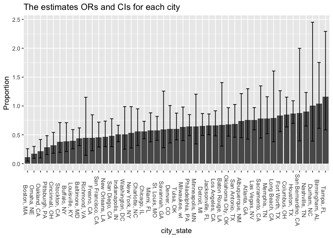
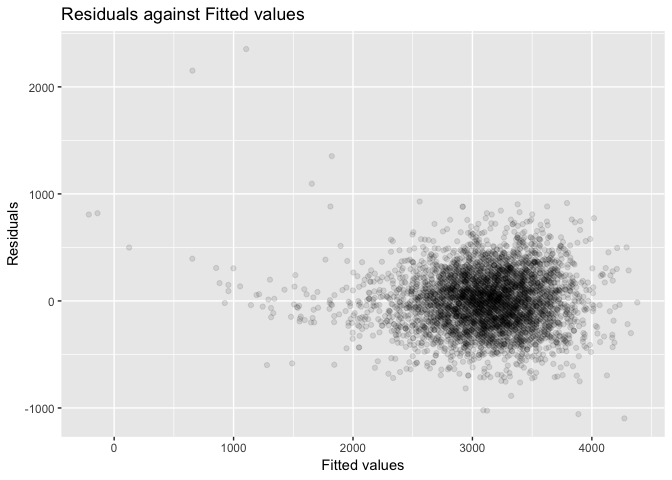

p8015\_hw6\_tl2882
================

Problem 1
=========

Tidy data
---------

``` r
data = 
  read_csv("https://raw.githubusercontent.com/washingtonpost/data-homicides/master/homicide-data.csv") %>% 
  unite(city_state, city, state, sep = ", ") %>% 
  filter(!city_state %in% c("Dallas, TX", "Phoenix, AZ", "Kansas City, MO", "Tulsa, AL")) %>% 
  mutate(bi_disposition = as.numeric(disposition == "Closed by arrest")) %>% 
  mutate(victim_race = ifelse(victim_race == "White", "white", "non-white") ) %>% 
  mutate(victim_race = fct_relevel(victim_race, "white")) %>% 
  mutate(victim_age = as.numeric(victim_age))
```

    ## Warning in evalq(as.numeric(victim_age), <environment>): NAs introduced by
    ## coercion

Model for Baltimore, MD
-----------------------

``` r
model = glm(bi_disposition ~ victim_age + victim_sex + victim_race, 
            data = filter(data, city_state == "Baltimore, MD"), family = binomial(link = "logit"))
result = broom::tidy(model, conf.int = TRUE)

result %>% 
  filter(term == "victim_racenon-white") %>%
  mutate(odds_ratio = exp(estimate), 
         conf_low = exp(conf.low), conf_high = exp(conf.high)) %>% 
  select(odds_ratio, conf_low, conf_high) %>% 
  knitr::kable()
```

|  odds\_ratio|  conf\_low|  conf\_high|
|------------:|----------:|-----------:|
|     0.440608|  0.3121625|   0.6196693|

This is the estimate and confidence interval of the adjusted odds ratio for solving homicides comparing non-white victims to white victims keeping all other variables fixed.

Model for each city
-------------------

``` r
data_results = 
  data %>% 
  group_by(city_state) %>% 
  nest() %>% 
  mutate(models = map(data, ~glm(bi_disposition ~ victim_age + victim_sex + victim_race, 
                                data = .x, family = binomial(link = "logit")))) %>% 
  mutate(results = map(models, broom::tidy)) %>% 
  mutate(results_ci = map(models, broom::confint_tidy)) %>% 
  select(-data, -models) %>% 
  unnest() 
```

``` r
results_ci = 
  data_results %>% 
  filter(term == "victim_racenon-white") %>% 
  mutate(odds_ratio = exp(estimate), 
         conf_low = exp(conf.low), conf_high = exp(conf.high)) %>% 
  select(city_state, odds_ratio, conf_low, conf_high)

results_ci
```

    ## # A tibble: 47 x 4
    ##    city_state      odds_ratio conf_low conf_high
    ##    <chr>                <dbl>    <dbl>     <dbl>
    ##  1 Albuquerque, NM      0.741   0.449      1.22 
    ##  2 Atlanta, GA          0.753   0.424      1.30 
    ##  3 Baltimore, MD        0.441   0.312      0.620
    ##  4 Baton Rouge, LA      0.668   0.304      1.41 
    ##  5 Birmingham, AL       1.04    0.612      1.75 
    ##  6 Boston, MA           0.115   0.0425     0.259
    ##  7 Buffalo, NY          0.390   0.210      0.710
    ##  8 Charlotte, NC        0.558   0.313      0.951
    ##  9 Chicago, IL          0.562   0.432      0.734
    ## 10 Cincinnati, OH       0.318   0.180      0.541
    ## # ... with 37 more rows

This is the estimate and confidence interval of the adjusted odds ratio for solving homicides comparing non-white victims to white victims keeping all other variables fixed.

### Plot

``` r
results_ci %>% 
  mutate(city_state = fct_reorder(city_state, odds_ratio)) %>%
  ggplot(aes(x = city_state, weight = odds_ratio)) +
    geom_bar() + 
    geom_errorbar(aes(ymin = conf_low, ymax = conf_high), width = 0.5) +
    labs(title = "The estimates ORs and CIs for each city", y = "Proportion") +
    theme(axis.text.x = element_text(angle = -90))
```



This is the plot that shows the estimated ORs and CIs for each city

Problem 2
=========

Tidy data
---------

``` r
data_baby = 
  read_csv("http://p8105.com/data/birthweight.csv") %>% 
  mutate(babysex = as.factor(recode(babysex, "1" = "male", "2" = "female"))) %>% 
  mutate(frace = as.factor(recode(frace, "1" = "White", "2" = "Black", "3" = "Asian", "4" = "Puerto Rican",
                                  "8" = "Other", "9" = "Unknown"))) %>% 
  mutate(mrace = as.factor(recode(mrace, "1" = "White", "2" = "Black", "3" = "Asian", "4" = "Puerto Rican",
                                  "8" = "Other"))) %>% 
  mutate(malform = as.factor(recode(malform, "0" = "absent", "1" = "present")))

sum(is.na(data_baby)) # 0 means no "TRUE"
```

    ## [1] 0

I converted numeric to factor where appropriate, and checked that there are no missing data.

Model Selection
---------------

I use stepwise regreession learned in "Biostatistical Methods" class. "Step" function uses AIC criterion for covariates selection. This methods develops a sequence of regression models, at each step adding or deleting a covariate.

``` r
fit  = lm(bwt ~ ., data = data_baby)
step(fit, direction = 'backward')
```

    ## Start:  AIC=48717.83
    ## bwt ~ babysex + bhead + blength + delwt + fincome + frace + gaweeks + 
    ##     malform + menarche + mheight + momage + mrace + parity + 
    ##     pnumlbw + pnumsga + ppbmi + ppwt + smoken + wtgain
    ## 
    ## 
    ## Step:  AIC=48717.83
    ## bwt ~ babysex + bhead + blength + delwt + fincome + frace + gaweeks + 
    ##     malform + menarche + mheight + momage + mrace + parity + 
    ##     pnumlbw + pnumsga + ppbmi + ppwt + smoken
    ## 
    ## 
    ## Step:  AIC=48717.83
    ## bwt ~ babysex + bhead + blength + delwt + fincome + frace + gaweeks + 
    ##     malform + menarche + mheight + momage + mrace + parity + 
    ##     pnumlbw + ppbmi + ppwt + smoken
    ## 
    ## 
    ## Step:  AIC=48717.83
    ## bwt ~ babysex + bhead + blength + delwt + fincome + frace + gaweeks + 
    ##     malform + menarche + mheight + momage + mrace + parity + 
    ##     ppbmi + ppwt + smoken
    ## 
    ##            Df Sum of Sq       RSS   AIC
    ## - frace     4    124365 320848704 48712
    ## - malform   1      1419 320725757 48716
    ## - ppbmi     1      6346 320730684 48716
    ## - momage    1     28661 320752999 48716
    ## - mheight   1     66886 320791224 48717
    ## - menarche  1    111679 320836018 48717
    ## - ppwt      1    131132 320855470 48718
    ## <none>                  320724338 48718
    ## - fincome   1    193454 320917792 48718
    ## - parity    1    413584 321137922 48721
    ## - mrace     3    868321 321592659 48724
    ## - babysex   1    853796 321578134 48727
    ## - gaweeks   1   4611823 325336161 48778
    ## - smoken    1   5076393 325800732 48784
    ## - delwt     1   8008891 328733230 48823
    ## - blength   1 102050296 422774634 49915
    ## - bhead     1 106535716 427260054 49961
    ## 
    ## Step:  AIC=48711.51
    ## bwt ~ babysex + bhead + blength + delwt + fincome + gaweeks + 
    ##     malform + menarche + mheight + momage + mrace + parity + 
    ##     ppbmi + ppwt + smoken
    ## 
    ##            Df Sum of Sq       RSS   AIC
    ## - malform   1      1447 320850151 48710
    ## - ppbmi     1      6975 320855679 48710
    ## - momage    1     28379 320877083 48710
    ## - mheight   1     69502 320918206 48710
    ## - menarche  1    115708 320964411 48711
    ## - ppwt      1    133961 320982665 48711
    ## <none>                  320848704 48712
    ## - fincome   1    194405 321043108 48712
    ## - parity    1    414687 321263390 48715
    ## - babysex   1    852133 321700837 48721
    ## - gaweeks   1   4625208 325473911 48772
    ## - smoken    1   5036389 325885093 48777
    ## - delwt     1   8013099 328861802 48817
    ## - mrace     3  13540415 334389119 48885
    ## - blength   1 101995688 422844392 49908
    ## - bhead     1 106662962 427511666 49956
    ## 
    ## Step:  AIC=48709.53
    ## bwt ~ babysex + bhead + blength + delwt + fincome + gaweeks + 
    ##     menarche + mheight + momage + mrace + parity + ppbmi + ppwt + 
    ##     smoken
    ## 
    ##            Df Sum of Sq       RSS   AIC
    ## - ppbmi     1      6928 320857079 48708
    ## - momage    1     28660 320878811 48708
    ## - mheight   1     69320 320919470 48708
    ## - menarche  1    116027 320966177 48709
    ## - ppwt      1    133894 320984044 48709
    ## <none>                  320850151 48710
    ## - fincome   1    193784 321043934 48710
    ## - parity    1    414482 321264633 48713
    ## - babysex   1    851279 321701430 48719
    ## - gaweeks   1   4624003 325474154 48770
    ## - smoken    1   5035195 325885346 48775
    ## - delwt     1   8029079 328879230 48815
    ## - mrace     3  13553320 334403471 48883
    ## - blength   1 102009225 422859375 49906
    ## - bhead     1 106675331 427525481 49954
    ## 
    ## Step:  AIC=48707.63
    ## bwt ~ babysex + bhead + blength + delwt + fincome + gaweeks + 
    ##     menarche + mheight + momage + mrace + parity + ppwt + smoken
    ## 
    ##            Df Sum of Sq       RSS   AIC
    ## - momage    1     29211 320886290 48706
    ## - menarche  1    117635 320974714 48707
    ## <none>                  320857079 48708
    ## - fincome   1    195199 321052278 48708
    ## - parity    1    412984 321270064 48711
    ## - babysex   1    850020 321707099 48717
    ## - mheight   1   1078673 321935752 48720
    ## - ppwt      1   2934023 323791103 48745
    ## - gaweeks   1   4621504 325478583 48768
    ## - smoken    1   5039368 325896447 48773
    ## - delwt     1   8024939 328882018 48813
    ## - mrace     3  13551444 334408523 48881
    ## - blength   1 102018559 422875638 49904
    ## - bhead     1 106821342 427678421 49953
    ## 
    ## Step:  AIC=48706.02
    ## bwt ~ babysex + bhead + blength + delwt + fincome + gaweeks + 
    ##     menarche + mheight + mrace + parity + ppwt + smoken
    ## 
    ##            Df Sum of Sq       RSS   AIC
    ## - menarche  1    100121 320986412 48705
    ## <none>                  320886290 48706
    ## - fincome   1    240800 321127090 48707
    ## - parity    1    431433 321317724 48710
    ## - babysex   1    841278 321727568 48715
    ## - mheight   1   1076739 321963029 48719
    ## - ppwt      1   2913653 323799943 48743
    ## - gaweeks   1   4676469 325562760 48767
    ## - smoken    1   5045104 325931394 48772
    ## - delwt     1   8000672 328886962 48811
    ## - mrace     3  14667730 335554021 48894
    ## - blength   1 101990556 422876847 49902
    ## - bhead     1 106864308 427750598 49952
    ## 
    ## Step:  AIC=48705.38
    ## bwt ~ babysex + bhead + blength + delwt + fincome + gaweeks + 
    ##     mheight + mrace + parity + ppwt + smoken
    ## 
    ##           Df Sum of Sq       RSS   AIC
    ## <none>                 320986412 48705
    ## - fincome  1    245637 321232048 48707
    ## - parity   1    422770 321409181 48709
    ## - babysex  1    846134 321832545 48715
    ## - mheight  1   1012240 321998651 48717
    ## - ppwt     1   2907049 323893461 48743
    ## - gaweeks  1   4662501 325648912 48766
    ## - smoken   1   5073849 326060260 48771
    ## - delwt    1   8137459 329123871 48812
    ## - mrace    3  14683609 335670021 48894
    ## - blength  1 102191779 423178191 49903
    ## - bhead    1 106779754 427766166 49950

    ## 
    ## Call:
    ## lm(formula = bwt ~ babysex + bhead + blength + delwt + fincome + 
    ##     gaweeks + mheight + mrace + parity + ppwt + smoken, data = data_baby)
    ## 
    ## Coefficients:
    ##       (Intercept)        babysexmale              bhead  
    ##         -6145.151            -28.558            130.777  
    ##           blength              delwt            fincome  
    ##            74.947              4.107              0.318  
    ##           gaweeks            mheight         mraceBlack  
    ##            11.592              6.594            -63.906  
    ## mracePuerto Rican         mraceWhite             parity  
    ##           -25.791             74.887             96.305  
    ##              ppwt             smoken  
    ##            -2.676             -4.843

So my model is:

``` r
model1 = lm(formula = bwt ~ babysex + bhead + blength + delwt + fincome + gaweeks + mheight + mrace + parity +          ppwt + smoken, data = data_baby)
```

### Plot

``` r
data_baby %>% 
  add_predictions(model1) %>% 
  add_residuals(model1) %>% 
  ggplot(aes(x = pred, y = resid)) +
    geom_point(alpha = 0.1) +
    labs(title = "Residuals against Fitted values", x = "Fitted values", y = "Residuals")
```



The plot is used to detect unequal error variance (heteroscedasticity) and outliers. Ideally, we would like to see that: • Residual values bounce around 0 • Residuals form a horizontal ‘band’ around zero: above and below (indication of equal variance) • No ‘unusual’ values stand out from the random pattern (indication of no potential outliers)
